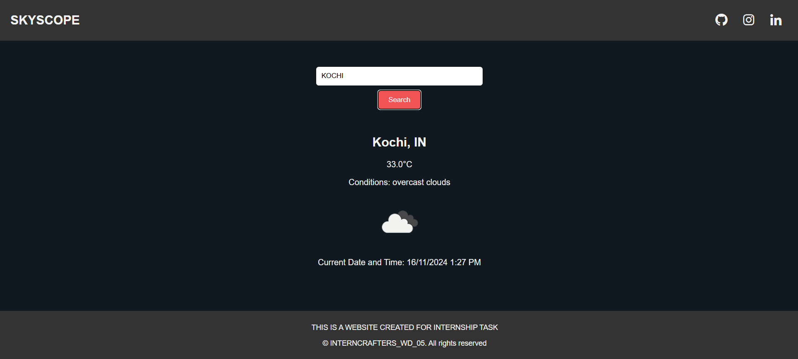

# INTERNCRAFTERS_WD_05

<p align="center">
<a href="#"></a>
</p>
<p align="center">
<a href="https://github.com/vxnuprasad"></a>
<a href="https://interncrafters.netlify.app/"></a>
</p>

# SKYSCOPE ( Weather Web Application )

This **Weather Web Application** fetches real-time weather data using a weather API. It allows users to view current weather conditions, temperature, humidity, wind speed, and other relevant details based on either the user's location (via geolocation) or a manually inputted location. Additionally, it displays the current date and time of the location and shows a graphical icon representing the climate condition (sunny, rainy, cloudy, etc.).

---

## Features

1. **Current Weather Data:**
   - Displays real-time weather data including temperature, humidity, wind speed, and weather conditions (e.g., sunny, rainy, etc.).
   
2. **User Location-based Fetching:**
   - Automatically detects the user's location using the browser’s geolocation feature and fetches weather data for that location.
   
3. **Manual Location Search:**
   - Allows users to enter any city or location to get weather details for that area.
   
4. **Date and Time Display:**
   - Shows the current date and time for the entered location, formatted appropriately.
   
5. **Graphic Icon for Weather Conditions:**
   - Displays an icon that visually represents the current weather condition (such as a sun for sunny, cloud for cloudy, etc.).
   
6. **User-Friendly Interface:**
   - Simple and interactive design for easy navigation.
   - Clear and easy-to-read display of weather details.

7. **Responsive Design:**
   - Fully functional on both desktop and mobile devices.

---

## How It Works

1. **HTML:** Structures the page, input fields for user location, and displays the weather data along with the date, time, and weather icon.
2. **CSS:** Styles the weather data display, making it visually appealing and responsive.
3. **JavaScript:**
   - Fetches weather data using a weather API (like OpenWeatherMap or WeatherAPI).
   - Retrieves the user's geolocation or allows manual input for a location.
   - Displays weather conditions dynamically based on the received data, including the weather icon, current temperature, and other details.
   - Fetches and displays the current date and time for the entered location using JavaScript.
   - Updates the page in real-time to show accurate weather conditions.

---

## Usage

### Clone the Repository:
```sh
git clone https://github.com/vxnuprasad/INTERNCRAFTERS_WD_05
```

### Open in Browser:
1. Navigate to the project folder.
2. Open the `index.html` file in any web browser.
3. Enter a location or allow geolocation to fetch the current weather.
4. The application will display the weather data, the current time and date for that location, and a graphic icon representing the weather.

---

## Contributions

If you find this project helpful, consider following [vxnuprasad](https://github.com/vxnuprasad) on GitHub! Feel free to fork the repository and contribute.

---

## Technologies Used

- **HTML:** To create the structure of the weather app interface.
- **CSS:** For styling the page and making it responsive.
- **JavaScript:** To fetch data from the weather API and dynamically display it.
- **Weather API:** (e.g., OpenWeatherMap, WeatherAPI) to get the real-time weather data.
- **Moment.js** or **Date object:** To format and display the time and date of the entered location.

---

## Find Me On:
[](https://www.linkedin.com/in/vxnuprasad)  
[](https://www.instagram.com/__.v.shnu/)  
